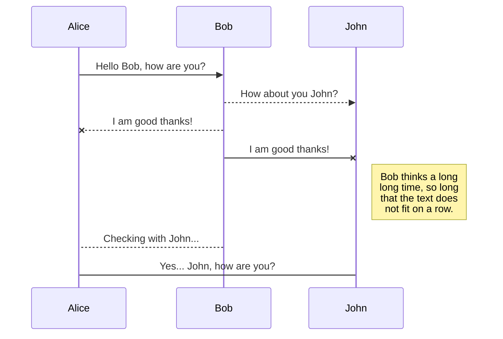
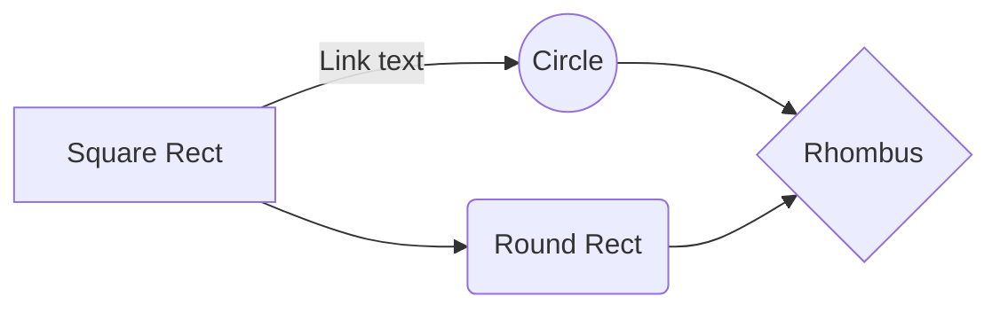

**Nombre:** Constantino Alto Hernández
**Matricula:** 23210541
**Fecha:** 12/02/2026

Las nuevas arquitecturas de procesadores orientadas a bajo consumo energético están transformando el diseño de dispositivos móviles, IoT, laptops ultraligeras e incluso centros de datos eficientes. En este trabajo te mencionare algunas de ellas.
##

En la actualidad, el diseño de procesadores está cada vez más enfocado en reducir el consumo de energía sin afectar demasiado el rendimiento. Esto se debe al crecimiento de dispositivos móviles, sistemas embebidos y equipos portátiles, donde la eficiencia energética es un factor fundamental.

Para lograrlo, las empresas han desarrollado nuevas arquitecturas más optimizadas, como las propuestas por Arm Ltd y RISC-V International, además de los diseños híbridos implementados por compañías como Intel y Advanced Micro Devices.
##

La arquitectura desarrollada por **Arm Ltd.** es una de las más utilizadas en dispositivos móviles.
### Características principales:
-   Basada en arquitectura **RISC** (instrucciones simples y eficientes).
-   Bajo consumo energético.
-   Diseño **big.LITTLE** (núcleos de alto rendimiento y núcleos de alta eficiencia).
-   Amplio uso en smartphones, tablets y microcontroladores.
    
Su eficiencia se debe a que el ISA está diseñado para ser simple, lo que reduce la complejidad interna del procesador y el consumo por instrucción.

## 

La arquitectura promovida por **RISC-V International** es un estándar abierto basado también en principios RISC. Su principal ventaja es que permite diseñar procesadores personalizados agregando únicamente las extensiones necesarias, lo que favorece el bajo consumo.

Es muy utilizada en investigación, IoT y sistemas de ultra bajo consumo.

### Características principales:
-   ISA **abierto y libre de licencias**.
-   Diseño **modular** (extensiones opcionales).
-   Posibilidad de eliminar funciones innecesarias para ahorrar energía.
-   Alta escalabilidad (desde microcontroladores hasta servidores).
-   Ideal para sistemas embebidos y dispositivos IoT.
-   Menor complejidad del hardware.

#

Empresas tradicionales como **Intel** y **Advanced Micro Devices** han adaptado la arquitectura x86 para mejorar su eficiencia energética mediante diseños híbridos.

Un ejemplo es **Alder Lake**, que combina núcleos de alto rendimiento con núcleos de eficiencia para optimizar el consumo según la carga de trabajo.

### Características principales:

-   Combinación de **núcleos P (Performance)** y **núcleos E (Efficiency)**.
-   Mejor distribución de tareas según demanda energética.
-   Mantienen compatibilidad con software x86 tradicional.
-   Gestión avanzada de energía y control térmico.
-   Uso frecuente en laptops modernas y PCs eficientes.

##

| Característica              | ARM                              | RISC-V                           | x86 Híbrida                          |
|----------------------------|----------------------------------|-----------------------------------|--------------------------------------|
| Tipo de ISA                | RISC                             | RISC (abierta)                    | CISC con diseño híbrido              |
| Filosofía de diseño        | Eficiencia energética nativa     | Modular y personalizable          | Núcleos P-core + E-core              |
| Enfoque de bajo consumo    | Alto rendimiento por watt        | Ajustable según implementación    | Uso de núcleos eficientes (E-cores)  |
| Modelo de licenciamiento   | Licencia propietaria             | Código abierto                    | Propietario                          |
| Nivel de consumo energético| Muy bajo                         | Muy bajo (según diseño)           | Medio-bajo                           |
| Compatibilidad software    | Alta (Android, Linux, macOS)     | En crecimiento                    | Muy alta (Windows, Linux)            |
| Ecosistema                 | Muy maduro                       | En expansión                      | Muy maduro                           |
| Dispositivos típicos       | Smartphones, tablets, servidores | IoT, embebidos, edge computing    | PCs, laptops modernas                |
| Ventaja principal          | Máxima eficiencia energética     | Flexibilidad total                | Compatibilidad tradicional           |
| Desventaja principal       | Dependencia de licencias         | Menor adopción global             | Mayor consumo base que ARM           |

## Save a file

You can save any file of the workspace to **Google Drive**, **Dropbox** or **GitHub** by opening the **Synchronize** sub-menu and clicking **Save on**. Even if a file in the workspace is already synced, you can save it to another location. StackEdit can sync one file with multiple locations and accounts.

## Synchronize a file

Once your file is linked to a synchronized location, StackEdit will periodically synchronize it by downloading/uploading any modification. A merge will be performed if necessary and conflicts will be resolved.

If you just have modified your file and you want to force syncing, click the **Synchronize now** button in the navigation bar.

> **Note:** The **Synchronize now** button is disabled if you have no file to synchronize.

## Manage file synchronization

Since one file can be synced with multiple locations, you can list and manage synchronized locations by clicking **File synchronization** in the **Synchronize** sub-menu. This allows you to list and remove synchronized locations that are linked to your file.

# Publication

Publishing in StackEdit makes it simple for you to publish online your files. Once you're happy with a file, you can publish it to different hosting platforms like **Blogger**, **Dropbox**, **Gist**, **GitHub**, **Google Drive**, **WordPress** and **Zendesk**. With [Handlebars templates](http://handlebarsjs.com/), you have full control over what you export.

> Before starting to publish, you must link an account in the **Publish** sub-menu.

## Publish a File

You can publish your file by opening the **Publish** sub-menu and by clicking **Publish to**. For some locations, you can choose between the following formats:

- Markdown: publish the Markdown text on a website that can interpret it (**GitHub** for instance),
- HTML: publish the file converted to HTML via a Handlebars template (on a blog for example).

## Update a publication

After publishing, StackEdit keeps your file linked to that publication which makes it easy for you to re-publish it. Once you have modified your file and you want to update your publication, click on the **Publish now** button in the navigation bar.

> **Note:** The **Publish now** button is disabled if your file has not been published yet.

## Manage file publication

Since one file can be published to multiple locations, you can list and manage publish locations by clicking **File publication** in the **Publish** sub-menu. This allows you to list and remove publication locations that are linked to your file.

# Markdown extensions

StackEdit extends the standard Markdown syntax by adding extra **Markdown extensions**, providing you with some nice features.

> **ProTip:** You can disable any **Markdown extension** in the **File properties** dialog.

## SmartyPants

SmartyPants converts ASCII punctuation characters into "smart" typographic punctuation HTML entities. For example:

|                |ASCII                          |HTML                         |
|----------------|-------------------------------|-----------------------------|
|Single backticks|`'Isn't this fun?'`            |'Isn't this fun?'            |
|Quotes          |`"Isn't this fun?"`            |"Isn't this fun?"            |
|Dashes          |`-- is en-dash, --- is em-dash`|-- is en-dash, --- is em-dash|

## KaTeX

You can render LaTeX mathematical expressions using [KaTeX](https://khan.github.io/KaTeX/):

The *Gamma function* satisfying $\Gamma(n) = (n-1)!\quad\forall n\in\mathbb N$ is via the Euler integral

$$
\Gamma(z) = \int_0^\infty t^{z-1}e^{-t}dt\,.
$$

> You can find more information about **LaTeX** mathematical expressions [here](http://meta.math.stackexchange.com/questions/5020/mathjax-basic-tutorial-and-quick-reference).

## UML diagrams

You can render UML diagrams using [Mermaid](https://mermaidjs.github.io/). For example, this will produce a sequence diagram:

And this will produce a flow chart:

